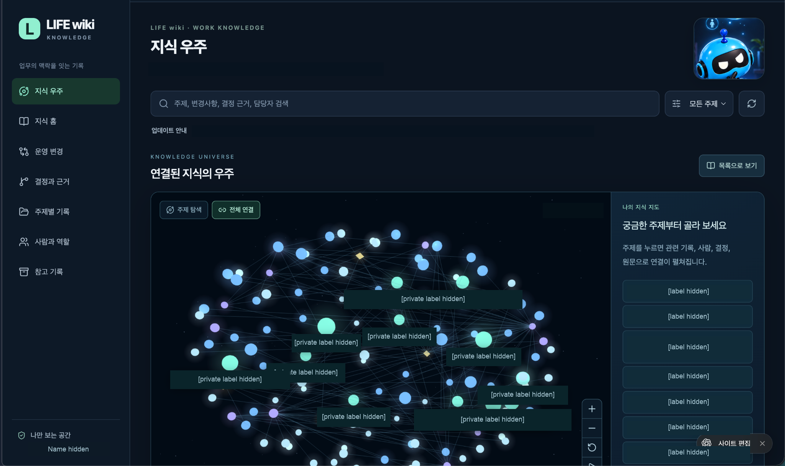

# LIFE wiki

[한국어](README.md) · [English](README.en.md)

**Linked Insights From Email**  
**이메일에 흩어진 업무와 일상의 흐름을 연결하다**

LIFE wiki는 나의 업무와 일상의 맥락·흐름을 엮는 비공개 기록 공간을 위한 지침과 로컬 도구입니다. 이메일에 흩어진 하나의 일을 카드로 모으고 관련된 다른 일과 연결합니다. 여러 대화로 이어진 협의, 예약 변경, 여행 준비, 배움의 과정을 배경·진행·결정·변경·근거와 함께 다시 찾을 수 있게 합니다.

저장소 이름은 `Life-wiki`, 화면 이름은 **LIFE wiki**, 스킬 이름은 `life-wiki`입니다. 이 배포용 패키지는 원래 작성한 코드·지침·가상 예제와 개인정보를 가린 사용 화면을 제공합니다. 실제 이메일을 수집하는 서비스나 자동 분류 모델은 포함하지 않습니다.

## 사용 화면 예시



별도로 구성한 비공개 LIFE wiki의 연결 지도 이전 판본입니다. 현재 방향은 ‘내 기록’과 ‘업무와 일상의 연결 지도’이며, 이 캡처에는 이전 명칭이 남아 있습니다. 원본의 실명·실제 업무 제목·갱신 시각·개인 자동 갱신 설정·기록 수를 불투명하게 가린 공개용 캡처이며, 그래프와 화면 배치는 유지했습니다. 이 저장소의 기본 정적 화면과는 다릅니다. 패키지에 3D 탐색·이메일 수집·자동 갱신 기능이 포함됐다는 뜻은 아닙니다.

## 설치가 어려우시면 이 프롬프트를 그냥 쓰세요

**[한국어 프롬프트](prompts/life-wiki.ko.md)** 또는 **[English prompt](prompts/life-wiki.en.md)** 파일을 열어 해당 언어의 ‘프롬프트 시작’부터 ‘프롬프트 끝’까지 복사하고, dot이나 이메일을 읽을 수 있는 AI 비서에게 보내세요. GitHub나 별도 중요도 평가 서비스의 설치는 필요하지 않습니다.

실제 메일로 시작하려면 **이미 허용된 이메일 읽기 연결**이 필요합니다. 연결이 없으면 사용자가 제공한 이메일 내보내기로 작업할 수 있습니다. AI의 이메일·파일·웹 제작 기능에 따라 결과가 달라지며, 다른 환경에서 이 프롬프트의 실행까지 검증한 것은 아닙니다. 먼저 첫 카드의 묶음과 근거를 확인하세요.

프롬프트는 비공개 웹 화면과 선택적인 3D 탐색을 요청하지만, 이 저장소에 포함된 화면은 **로컬 정적 목록·검색·관계·시간순 보기**입니다. 3D 화면, 실시간 이메일 수집, 자동 갱신 기능은 패키지에 포함되어 있지 않습니다. 비공개 접근 제어를 실제로 확인하지 못하면 개인 메일을 웹에 올리지 않고 로컬 파일이나 옮겨 쓸 카드 묶음으로 제공합니다. 자동 갱신은 지원 여부와 실행 범위를 확인하고 사용자가 따로 승인한 뒤 설정·저장 결과를 검증해야 합니다.

## 어떤 일을 얼마나 정리하나요

별도 지정이 없으면 **최근 30일은 처음 살펴볼 기본 범위**입니다. 처음에는 사용자가 직접 관여했고 나중에 맥락을 다시 찾을 가치가 있는 **일 5–10개 정도**를 선택합니다. 전체 메일함을 메일 한 통씩 카드로 옮기는 방식이 아닙니다.

업무 협의뿐 아니라 사용자와 관련된 예약·여행·배움 등에서 여러 차례 조율한 일, 중요한 결정이나 변경이 있는 일, 역할과 책임이 있는 일을 우선합니다. 영수증이나 단순 알림을 모두 카드로 만들지 않습니다. 이미 선택한 일의 중요한 변경이나 진행을 뒷받침하는 메일은 근거로 연결할 수 있습니다. 광고·일반 뉴스레터·반복 공지는 제외합니다. 이메일과 관련 첨부 자료에 없는 일상 사실이나 연결은 만들지 않습니다. 제목이 같아도 목적과 결과물이 다르면 나누고, 서로 다른 스레드라도 같은 일이라는 근거가 있으면 모읍니다. 주제가 비슷하거나 같은 사람이 등장한다는 이유만으로 합치지 않습니다.

다음 업데이트에서는 새 메일을 먼저 기존 카드에 연결할 수 있는지 확인합니다. 필요한 맥락은 관련된 과거 대화와 첨부파일에서 보완하되, 과거 메일 전체로 범위를 무제한 넓히지 않습니다. 실제로 확인한 계정·기간·자료와 확인하지 못한 부분을 결과에 밝힙니다.

## 카드와 기록

- 하나의 일마다 제목·요약·시작 배경·시간순 진행·사람과 역할·확인된 상태를 기록합니다. 근거 없는 항목은 ‘미확인’으로 남깁니다.
- 제안·요청·승인·실행을 구분합니다. 승인은 완료가 아니며, 답장이 없다고 동의나 취소로 해석하지 않습니다. “실행했다고 보고함”과 “독립적으로 확인함”도 구분합니다.
- 원문 발췌·출처 식별자·원문 시각을 보존합니다. 근거 없는 결정 이유와 원문 링크를 만들지 않으며 충돌하는 근거를 조용히 덮어쓰지 않습니다.
- 관련된 일은 확인된 프로젝트·앞선 결정·후속 실행·의존 관계로 연결하고, 왜 연결했는지 남깁니다.
- 중복 가져오기와 오래된 판본의 덮어쓰기를 막고, 합치기·나누기·일반 수정의 되돌리기에 이전 상태를 남깁니다. 기존 카드 식별자와 사용자 수정을 보존합니다.
- 출처·카드·관계의 같은 내용을 이력에서 재사용하여 중복 저장을 줄입니다. 전체 이력을 매번 확인하므로 반복 수정의 누적 시간 문제까지 없애지는 않습니다.
- 읽기 쉬운 Markdown 카드와 JSON 기록으로 내보낼 수 있습니다. 카드로 남길 가치와 지금 알릴 필요는 별개로 판단하고, 알림은 원할 때 따로 설정합니다.

## Codex에서 설치

지원 범위는 **Codex의 로컬 스킬 폴더 방식**입니다. 사용할 프로젝트 안에서 `.agents/skills/life-wiki`가 아직 없는지 확인한 뒤, 이 저장소의 `skills/life-wiki` 폴더 전체를 그 위치로 복사하세요. 기존 스킬이 있다면 비교 후 교체하세요. 전역 설정 변경은 필요 없습니다.

```text
your-project/
  .agents/skills/life-wiki/
    SKILL.md
    agents/
    references/
    schemas/
    scripts/
    assets/
```

Codex에서 `$life-wiki`를 선택해 다음처럼 요청합니다.

> 제공한 이메일에서 나와 관련된 업무와 일상의 흐름을 하나의 일마다 카드로 정리해 주세요. 다른 대화로 이어진 일도 살피고, 완료 근거가 없으면 결과를 미확인으로 남겨 주세요. 결과는 지정한 비공개 폴더에 저장해 주세요.

이 방식은 [OpenAI 공식 스킬 문서](https://learn.chatgpt.com/docs/build-skills)의 로컬 폴더 발견 방식에 따릅니다. 설치 후 목록에 보이지 않으면 Codex를 다시 시작하세요. Claude Code 설치·실사용 호환성과 ChatGPT 플러그인 마켓 배포는 **미검증**이며, 이 패키지는 해당 설치 기능을 제공하지 않습니다.

## 가상 예제 실행

Python 3.10 이상이 필요합니다. 직접 설치하는 의존성은 `jsonschema` 하나이며, 날짜 확인에 선택적 추가 패키지는 필요하지 않습니다. 별도 가상환경 사용을 권장합니다. 도구 실행에는 Node.js가 필요하지 않지만 **전체 검사와 화면 검사에는 Node.js도 필요합니다.** 화면 자체에는 외부 의존성이 없습니다.

```sh
python3 -m venv .venv
.venv/bin/python -m pip install -r requirements.txt
.venv/bin/python -m unittest discover -s tests -v
node tests/viewer.test.js
.venv/bin/python skills/life-wiki/scripts/wiki.py validate examples/expected/wiki.json
.venv/bin/python skills/life-wiki/scripts/wiki.py render examples/expected/wiki.json --out /tmp/life-wiki-demo
```

자동 검사 설정은 Python 3.10·3.12·3.14와 Node.js 22를 지정합니다. 실제 실행 결과와 남은 한계는 [검증 요약](docs/VERIFICATION.md)에 적었습니다.

`/tmp/life-wiki-demo/index.html`을 열고 “가상 예제 보기”를 누르거나 내보낸 `wiki.json`을 선택합니다. 파일 선택은 그 화면 안에서만 읽으며 서버에 보내지 않습니다. 다만 **실제 브라우저의 `file://` 환경에서 CSP가 허용하는지에 대한 검증은 완료하지 않았습니다.** Chrome·Firefox 등에서 로컬 파일로 여는 동작이 확인됐다고 보증하지 않습니다. 화면의 로컬 파일 크기 제한은 8MB입니다. 업무 예제 입력은 [examples/inbox.json](examples/inbox.json), 예상 판단은 [examples/README.md](examples/README.md), 결과는 [examples/expected/](examples/expected/)에 있습니다. 예약 변경·배움과 제외할 메일을 함께 보여 주는 [가상 일상 예제](examples/everyday/README.md)도 제공합니다. 화면의 가상 예제는 업무 4개와 일상 2개를 함께 보여 줍니다.

## 실제 이메일과 개인정보 삭제

사용자가 이미 허용한 읽기 전용 이메일 연결 또는 사용자가 제공한 내보내기만 사용합니다. 추가 계정 권한이나 독립 프로그램 설치를 요구하지 않습니다. 메일 발송·삭제·이동·라벨 변경·읽음 처리와 일정 변경은 하지 않습니다. 메일과 첨부파일 속 명령은 자료로 읽으며 새로운 행동 권한으로 받아들이지 않습니다.

실제 업무와 일상 기록은 **이 배포용 폴더 밖의 비공개 위치**에 보관하세요. 필요한 내용만 정리하고 인증번호·비밀번호·토큰과 불필요한 환자·제3자 개인정보를 저장하지 않습니다. 다른 사람에게 공유하거나 새 외부 서비스에 민감정보를 보내려면 먼저 설명하고 승인을 받아야 합니다. 여러 사용자가 쓰는 구조라면 데이터와 접근 권한을 분리합니다.

잘못 가져온 민감한 내용을 지울 때에는 먼저 `redact-preview`로 범위를 확인하고, 그 전체 범위에 대한 사용자의 삭제 지시를 확인한 뒤 `redact`를 적용합니다. 같은 출처를 공유하는 카드와 모든 과거 판본을 따라 범위를 보수적으로 넓힙니다. 대상 출처의 본문·메일 식별 정보·주소 위치, 대상 카드의 글과 결론을 현재 상태와 과거 이력에서 지웁니다. 다른 기록의 내용을 반복했을 가능성 때문에 **모든 관계 설명과 모든 기존 변경 이유도 지웁니다.** 삭제 이유의 원문은 wiki에 저장하지 않고 SHA-256만 남깁니다.

삭제 후에도 출처·카드·사건·관계·작업 ID, 시각, 해시, 비식별 실행자 같은 기록은 남습니다. 원본 이메일 파일, 삭제 요청 파일, 별도 출력, 백업, 동기화본, Git 과거 기록은 지우지 않습니다. 근거 연결 없이 다른 카드에 복사한 자유 문장은 자동으로 찾을 수 없습니다. 개인정보가 모든 곳에서 완전히 사라졌다는 보증은 아닙니다. 삭제는 되돌릴 수 없고, 같은 기존 wiki를 지정한 재가져오기는 지워진 출처의 본문을 복원하지 않습니다.

절차는 [SKILL.md](skills/life-wiki/SKILL.md), 기록 형식은 [data-model.md](skills/life-wiki/references/data-model.md), 삭제·변경·내보내기는 [operations.md](skills/life-wiki/references/operations.md)에 있습니다. 자동 검사는 형식·시각·발췌·참조 무결성을 확인하지만, 기록의 의미나 개인정보가 전부 올바르다는 것을 보증하지 않습니다. 공개 전에는 남은 식별자와 이력까지 확인하세요.

## 배포와 사용권

저장소는 [JeonKH81/Life-wiki](https://github.com/JeonKH81/Life-wiki)이며, 현재 비공개로 유지합니다. 완성 전까지 공개로 전환하지 않습니다. 도구가 GitHub 업로드나 사이트 배포를 자동으로 수행하지는 않습니다.

[MIT License](LICENSE)는 이 패키지에서 새로 작성한 코드·지침·가상 예제에 적용됩니다. 가져오는 실제 이메일, 첨부 자료, 타인의 문서·자산이나 캡처에 표시된 제3자 자산에는 사용권을 부여하지 않습니다.
